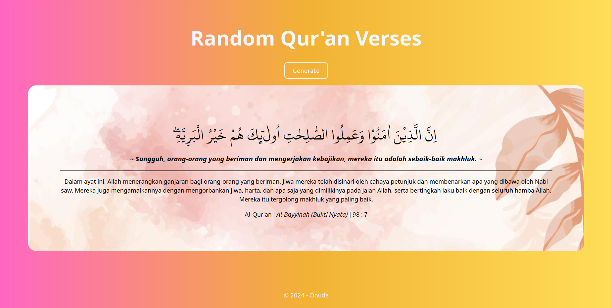

# Link Deploy

https://alquran-random-verse.vercel.app/

# Clone Repository

`git clone https://github.com/onuda22/alquran-random-verse.git`

# npm install

`npm i`

# running program

`npm run dev`

# Info

Aplikasi ini menggunakan json-server yang datanya diperoleh dari `https://json-server-vercel-puce-gamma.vercel.app/api/`

Namun, jika ingin menggunakan json-server dalam localhost dapat menggunakan file `db.json`

# Documentation

